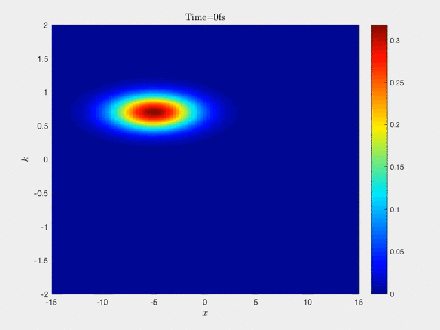
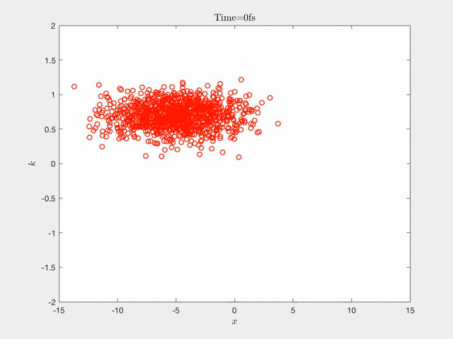

# Yunfeng Xiong (熊云丰）

I am currently working at Peking Univeristy as Boya Postdoctoral Fellow. I got my Ph.D. degree of computational mathematics in June, 2020, at Peking University, China, under the supervision of Prof. Sihong Shao. The title of my thesis is _Many-body Wigner dynamics: Branching Random Walk and Particle Annihilation_.

Please [click here](./CV_PKU_Yunfeng_Xiong.pdf) to see my curriculum vitae.

# Research interest

My major research interest is the mathematical theory of particle methods, as well as their applications in solving high-dimensional PDEs arsing from the quantum physics and finances.  

The concept of particle method is closely related to the Monte Carlo methods. However, the usage of particle methods does not merely involve sampling process, but actually they are integrated applications of stochastic process, numerical mathematics, number theory, statistical learning, combinatorics, harmonic analysis and so on. 


* * *

## Particle methods in quantum mechanics 

My graduate research concentrates on the particle method of the Wigner equation, a phase-space formulation of quantum dynamics initialized by Eugene Wigner. The fundamental obstacle is the **negative sign** in the probailistic model, which might be disliked by mathematicians majored in probability theory, but seems fundamental for physicists as the **negative probability** in quantum world intuitively manifests the Heisenberg's uncertainty principle.  

After fighting with the notorious negative sign problem for five years, I have tried to understand its origin and made the first attempt to solve the Wigner equation on the 12-D phase space, with both developments in particle generation and annihilation. But it still has a long way to go before touching the limit of the particle method. 

Currently, I am trying to extend the basic idea of the proposed particle method to solve high-dimensional PDEs and to understand the complicated interaction between multiple assets. 

* * *

### Particle generation: Connection between stochastic process and PDEs

Connection between stochastic processes and PDEs is an active topic in modern mathematics and provides powerful tools for both probability theory and analysis. The particle method borrows its essential idea but can be extended to a more general class of PDEs (beyond parabolic-type and elliptic-type) by introducing the negative particle sign.

The following animation is the Wigner dynamics of an electron interacting with a Gaussian barrier in the phase space.



Under the particle formalism, the dynamics seems likes the stochastic reproduction and mitigation of two swarms. An interesting observation is that by taking expectation, the behaviours of particles obey some rules driven by the deterministic equation. So our main goal is to understand the profound connection behind it.




* * *

### Particle annihilation: Probability theory and combinatorics 

Intuitively, the contribution of particles carrying opposite sign can be canceled out. This observation is pivital in suppressing the stochastic variances in long-time simulations. Such is closely related to the density estimation in statistical learning, which intends to postulate the underlying continuous density from the discrete point distribution. 


Our strategy is to combine the sequential clustering of points and random matching within each group. The sequential clustering can be performed by binary splitting of the Eucledian space and controlling the number-theoretic discrepancies. This can automatically monitor the concentration and sparsity of point distributions, and may work in high dimensional problem (numerical examples are provided up to 1080 dimension).


* * *

### Deterministic methods 

* * *

## Ongoing project: Diffusive wave modeling 


> This is a blockquote following a header.
>
> When something is important enough, you do it even if the odds are not in your favor.

### Header 3

```js
// Javascript code with syntax highlighting.
var fun = function lang(l) {
  dateformat.i18n = require('./lang/' + l)
  return true;
}
```

```ruby
# Ruby code with syntax highlighting
GitHubPages::Dependencies.gems.each do |gem, version|
  s.add_dependency(gem, "= #{version}")
end
```

#### Header 4

*   This is an unordered list following a header.
*   This is an unordered list following a header.
*   This is an unordered list following a header.

##### Header 5

1.  This is an ordered list following a header.
2.  This is an ordered list following a header.
3.  This is an ordered list following a header.

###### Header 6

| head1        | head two          | three |
|:-------------|:------------------|:------|
| ok           | good swedish fish | nice  |
| out of stock | good and plenty   | nice  |
| ok           | good `oreos`      | hmm   |
| ok           | good `zoute` drop | yumm  |

### There's a horizontal rule below this.

* * *

### Here is an unordered list:

*   Item foo
*   Item bar
*   Item baz
*   Item zip

### And an ordered list:

1.  Item one
1.  Item two
1.  Item three
1.  Item four

### And a nested list:

- level 1 item
  - level 2 item
  - level 2 item
    - level 3 item
    - level 3 item
- level 1 item
  - level 2 item
  - level 2 item
  - level 2 item
- level 1 item
  - level 2 item
  - level 2 item
- level 1 item

### Small image


### Large image


### Definition lists can be used with HTML syntax.

<dl>
<dt>Name</dt>
<dd>Godzilla</dd>
<dt>Born</dt>
<dd>1952</dd>
<dt>Birthplace</dt>
<dd>Japan</dd>
<dt>Color</dt>
<dd>Green</dd>
</dl>

```
Long, single-line code blocks should not wrap. They should horizontally scroll if they are too long. This line should be long enough to demonstrate this.
```

```
The final element.
```
